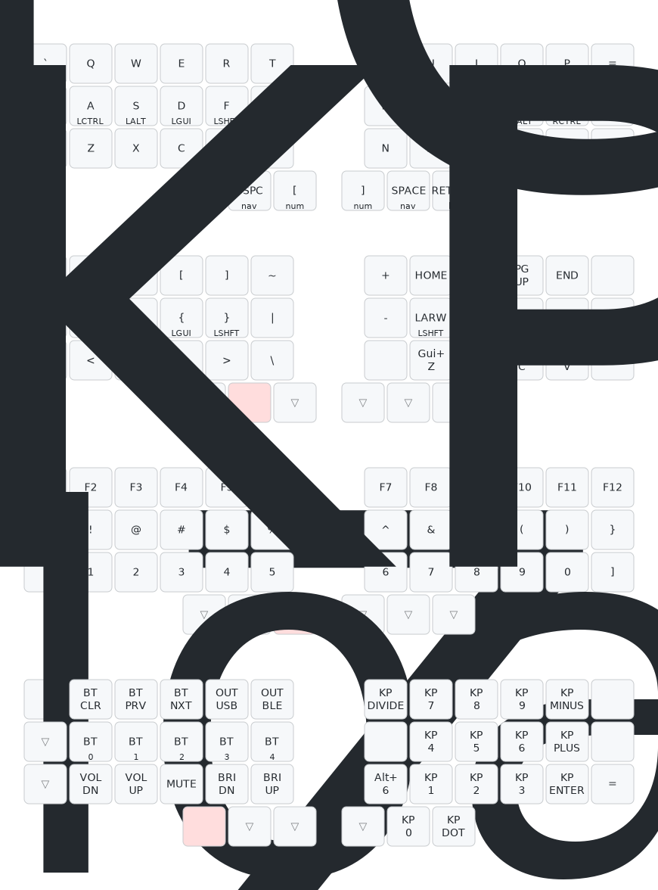
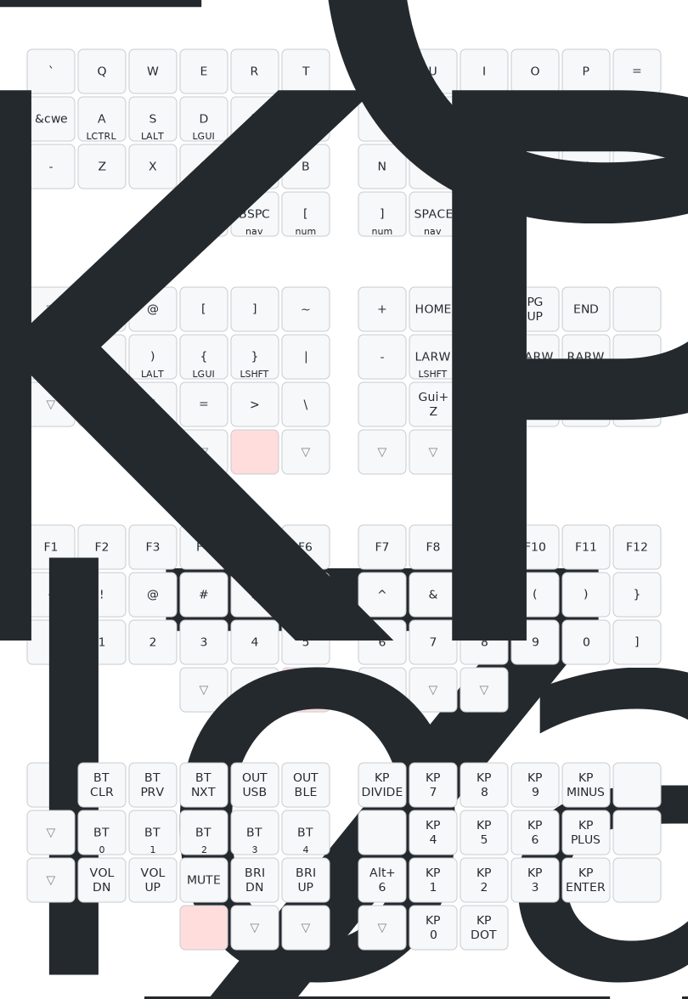
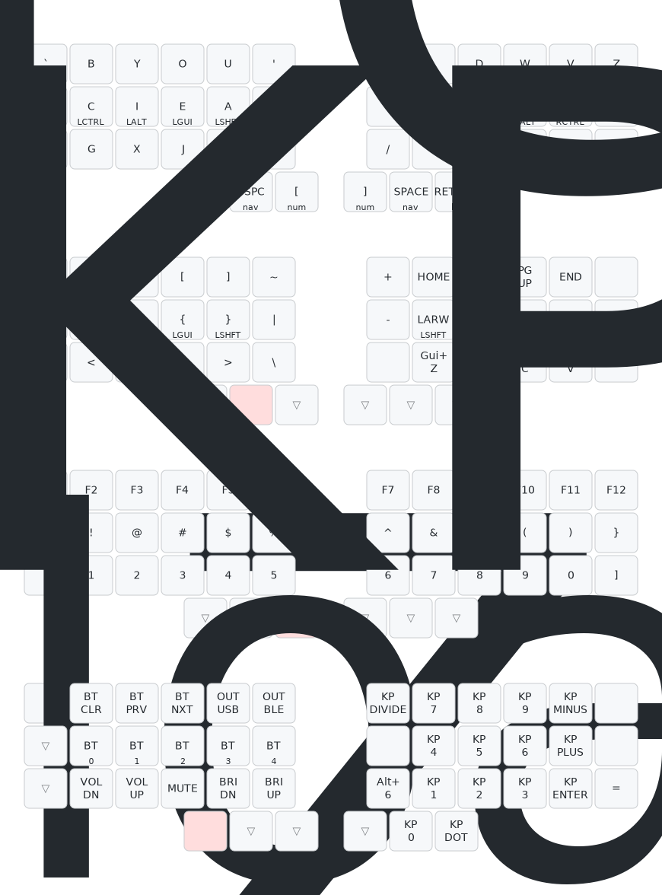

# Engram Configs

This repository includes Pete's revxlp config, forked and adapted for the [engram](https://engram.dev), [engrammer](https://github.com/sunaku/engrammer), and [qwerty-flip](https://nick-gravgaard.com/qwerty-flip/) layouts. 

Also includes a (mostly) matching kmonad .kbd file for parity on a MacBook keyboard, and a plist for starting on launch (copy the plist to `/Library/LaunchDaemons` and change the `/Users/you` to your username). If you use the launchdaemon plist, you'll need to add kmonad to Settings > Privacy & Security > Input Monitoring each time you update kmonad. 

## Installation

You can download the firmwares from the latest successful build using [this link](https://nightly.link/willpuckett/revxlp-config-engram/workflows/build/main/firmware.zip).

## Layout Maps

These maps were made with the awesome [keymap drawer](https://keymap-drawer.streamlit.app) by caksoylar.  

### QWERTY

### QWERTY-FLIP

### ENGRAM

### ENGRAMMER

