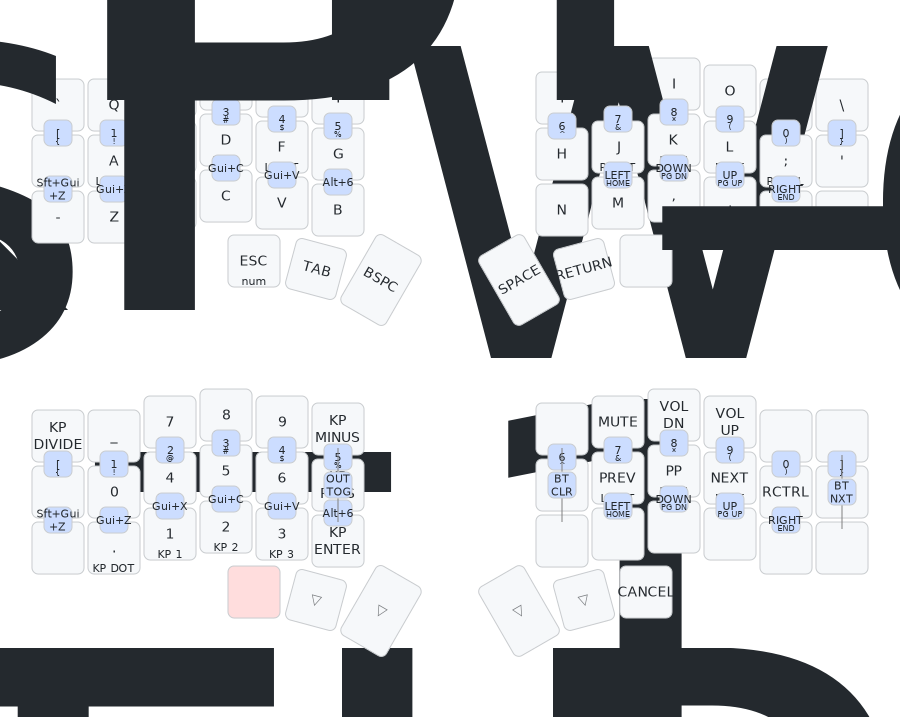
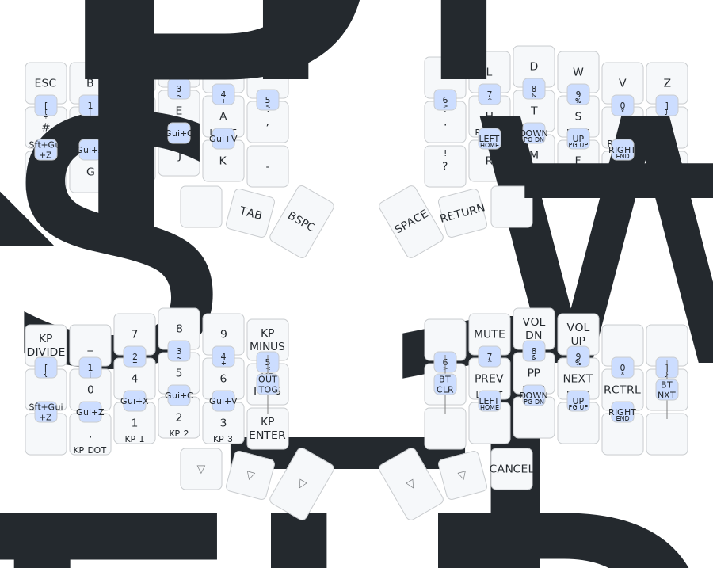
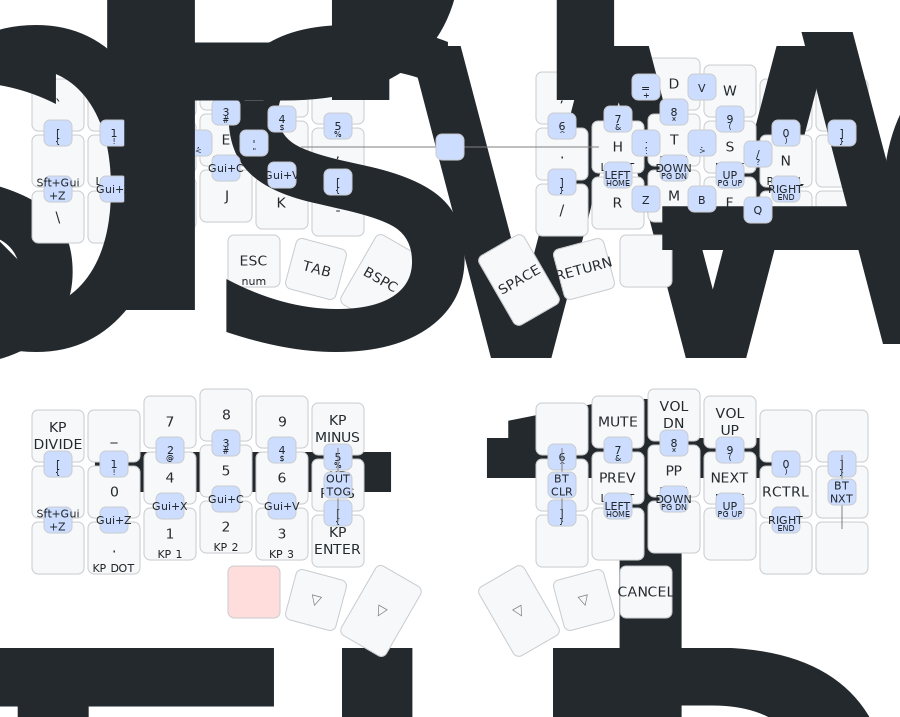

# Engram Configs

This repository includes the [engram](https://engram.dev),
[engrammer](https://github.com/sunaku/engrammer), and
[qwerty-flip](https://nick-gravgaard.com/qwerty-flip/) layouts for the
[revxlp](https://kbd.news/revxlp-1787.html). The [revxlp shield](https://github.com/petejohanson/revxlp-module) is referenced using the [ZMK module system](https://zmk.dev/docs/features/modules).

> [!TIP]
> Also included is a (mostly) matching kmonad `.kbd` file for parity on a
> MacBook keyboard, and a plist for starting on launch (copy the plist to
> `/Library/LaunchDaemons` and change the `/Users/you` to your username). If you
> use the launchdaemon plist, you'll need to add kmonad to
> `Settings > Privacy & Security > Input Monitoring` each time you update
> kmonad.

## Installation

You can download the firmwares (and associated keymap drawings) from the latest
successful
[release](https://github.com/willpuckett/revxlp-config-engram/releases/latest).

## Layout Maps

These maps were made with the awesome
[keymap drawer](https://keymap-drawer.streamlit.app) by caksoylar.

### QWERTY

### QWERTY-FLIP

### ENGRAM

### ENGRAMMER

